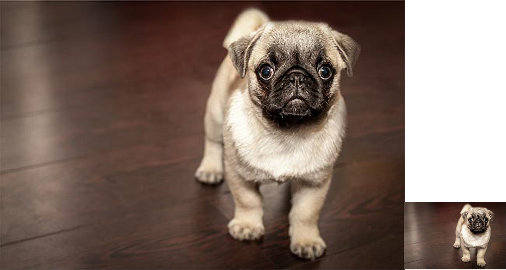
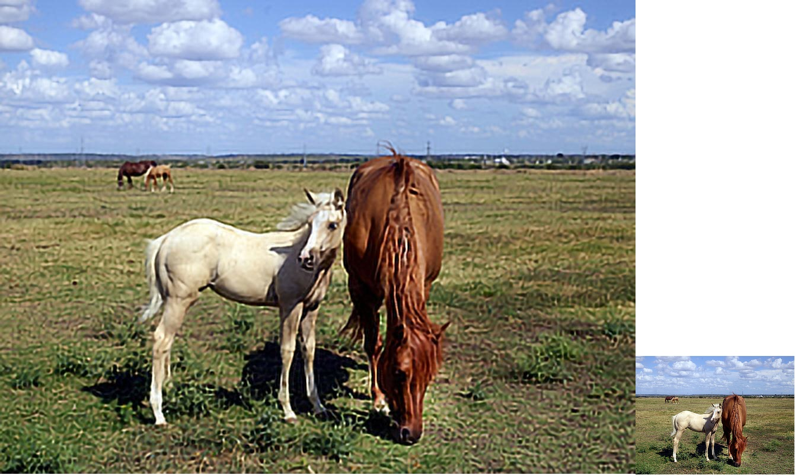
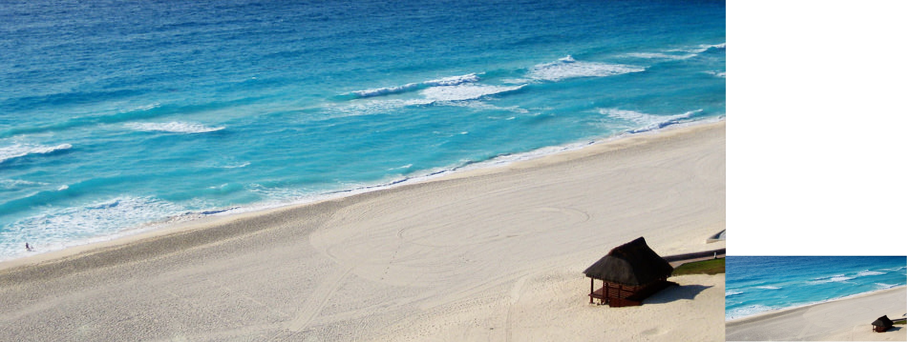

# **DLSS for All**

As someone who spends the other part of his free time playing video games, I find DLSS very intersting. If you are not familiar with DLSS, it stands for Deep Learning Super Sampling. It is a way for game studios to make games run smoother by training it on Nvidia's application that uses specific hardware and software as a way to have the GPU render everything in a lower resolution, and that lower resolution is then upscaled to the user's desire.

I took a bit of a different approach. Nvidia's DLSS only goes up to a resolution scale of 3x, while mine goes up to 4x. I chose to adapt the the EDSR model ([link to paper](https://arxiv.org/abs/1707.02921)), which is more of a deep convolutional neural network, and is not meant for fast computations.

---

## **Results:**
Searching google for a few low resolution copyright free images, we can see how the model performs:

---

## **Future Improvements:**
Currently, the model seems to not be doing well with extremely small images. The original horses image is 200x268, and the upscaled image looks somewhat noisy and blurred, yet despite this the horse's mane isn't a mess, which is a good sign. The model also seems to have a hard time with images that have a lot of detail, such as the image of the pug. The beach image is a good example of how the model can handle a lot of detail, but it still has some noise. I believe that the model can be improved by training it on more images, and also by using a different model. I am currently looking into the SRGAN model, which is a generative adversarial network, and is meant for fast computations.

Other improvements I can make include:
- Adding a denoising and sharpening filter to the upscaled image
- Adding more images to the training set
- Use EDSR+ which is a bigger model with geometric self-ensembling outlined in the same paper as EDSR